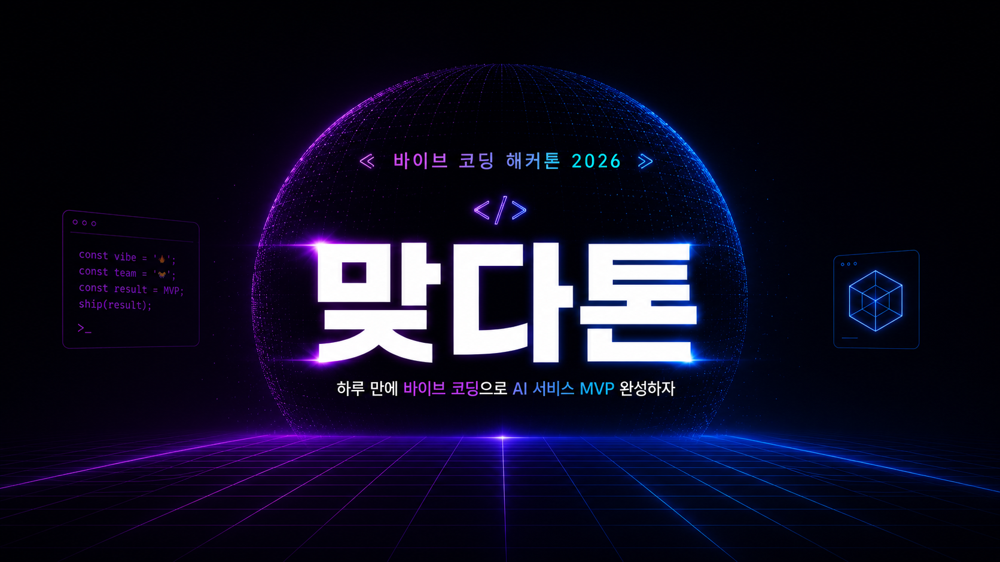
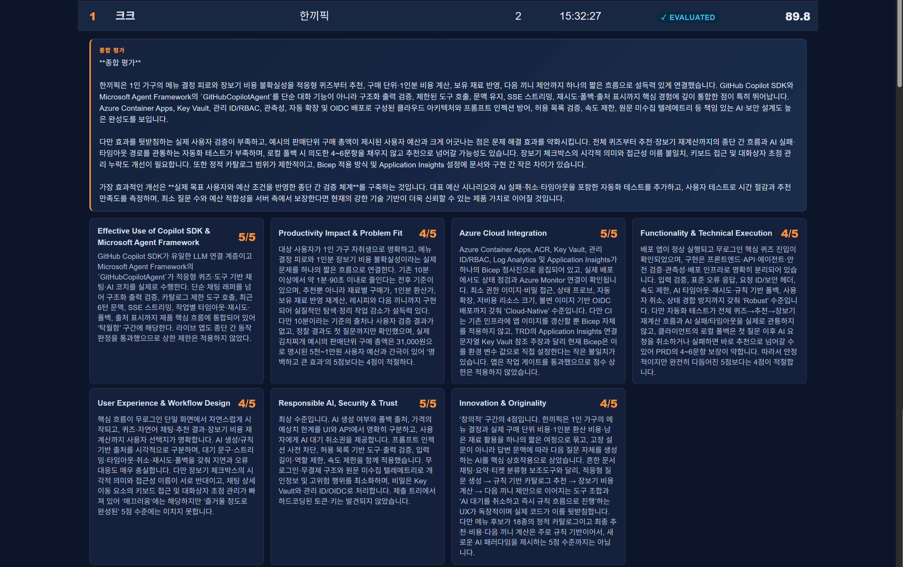
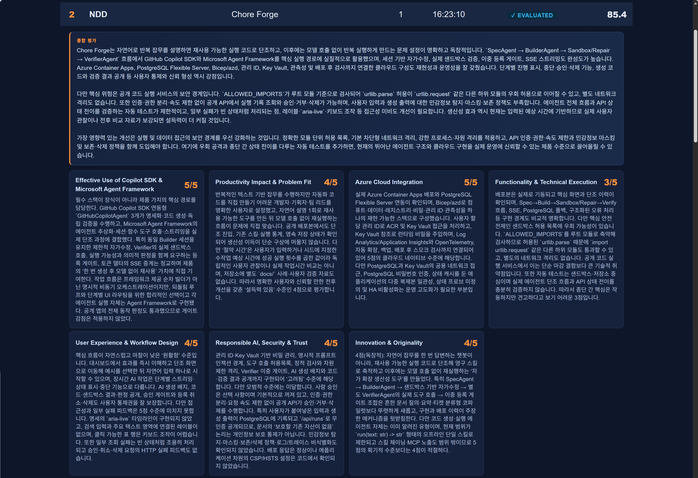
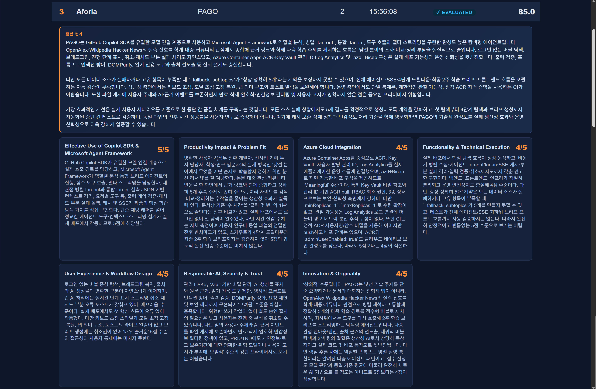

**제 1회 맞다톤을 성황리에 끝마쳤습니다. 다음에 더욱 풍성한 행사로 여러분을 찾아뵙겠습니다**

# 맞다톤 2026

  

  
<strong>제 1회 맞다톤에 오신 것을 환영합니다!</strong>

## 행사 정보

자세한 행사 정보는 [https://bit.ly/matdathon-2026](https://bit.ly/matdathon-2026) 페이지를 참고하세요.

## 대회 방식

- 도전 과제: **개인 생산성 향상 앱**
- 제한 시간: 5시간 30분
- 사용 도구: 아래 나열한 도구들만 사용하세요. 타사의 AI 코딩 도구는 허용하지 않습니다.
  - [VS Code](https://code.visualstudio.com/download) + [GitHub Copilot](https://marketplace.visualstudio.com/items?itemName=GitHub.copilot-chat)
  - [GitHub Copilot CLI](https://docs.github.com/copilot/how-tos/copilot-cli)
  - [GitHub Copilot app](https://docs.github.com/copilot/how-tos/github-copilot-app)
- 기술 스택: 웹 앱
- 사용 언어: 자유 선택
- 배포 플랫폼: Azure 클라우드

## 시간 계획

| 시간          | 내용                              |
|---------------|-----------------------------------|
| 09:00 - 09:30 | 체크인                            |
| 09:30 - 09:40 | 오프닝                            |
| 09:40 - 10:00 | 오프닝 키노트                     |
| 10:00 - 12:00 | 커뮤니티 세션                     |
| 12:00 - 12:10 | 도전 과제 세부 사항 및 심사 안내  |
| 12:10 - 16:30 | 해커톤 (중식 제공)                |
| 16:30 - 17:30 | 심사 및 발표                      |
| 17:30 - 18:00 | 시상 및 클로징                    |

## 대회 전 사전 준비 사항

Discussions 보드의 [행사 참가를 위해 꼭 알고 있어야 할 내용입니다](https://github.com/matdaaiga-kr/matdathon-2026/discussions/8) 포스트를 참고하세요.

- [**내 GitHub 계정은 맞다톤에서 쓸 수 있을까?**](https://github.com/matdaaiga-kr/matdathon-2026/discussions/7)
- [**Azure 무료 계정 및 구독 생성 방법**](https://github.com/matdaaiga-kr/matdathon-2026/discussions/2)

## 대회 규칙

- [맞다톤 규칙](./policies/policy-rules.md)

## 심사 항목

- [해커톤 평가 기준](./judgement/judgement-criteria.md)

## 도전 과제

여러분은 "개인 생산성 향상 앱" 만드는 것을 목표로 합니다. 아래 제약사항을 지켜 앱을 개발한 후 배포해 주세요.

- 주제: **개인 생산성 향상 앱**
- 필수요소:
  - 반드시 **웹 앱**으로 개발할 것
  - 반드시 **Microsoft Agent Framework**과 **GitHub Copilot SDK** 사용할 것
  - 반드시 **Azure 플랫폼**으로 배포할 것

## 팀 빌딩

앱 개발 후 제출을 위해서는 팀 빌딩이 필수적입니다. 팀은 개인으로 또는 최대 4명까지 만들 수 있습니다. 팀 빌딩 후 아래 링크를 통해 등록해 주세요.

팀 등록하기 👉 [https://matdaaiga.kr/matdathon/issues](https://matdaaiga.kr/matdathon/issues)

## 앱 제출

앱을 다 개발하셨으면 아래 링크를 통해 앱을 제출해 주세요. 마감 시각은 16시 30분입니다.

앱 제출하기 👉 [https://matdaaiga.kr/matdathon/issues](https://matdaaiga.kr/matdathon/issues)

## 입상자 명단

> [!NOTE]
> 입상자의 코드 샘플을 [맞다AI가 조직](https://github.com/matdaaiga-kr)으로 포크한 후 아카이빙 처리했습니다.

### 1등: 크크 | 한끼픽 | [https://github.com/matdaaiga-kr/hankkipick](https://github.com/matdaaiga-kr/hankkipick)

### 2등: NDD | Chore Forge | [https://github.com/matdaaiga-kr/chore-forge](https://github.com/matdaaiga-kr/chore-forge)

### 3등: Aforia | PAGO | [https://github.com/matdaaiga-kr/pago](https://github.com/matdaaiga-kr/pago)

