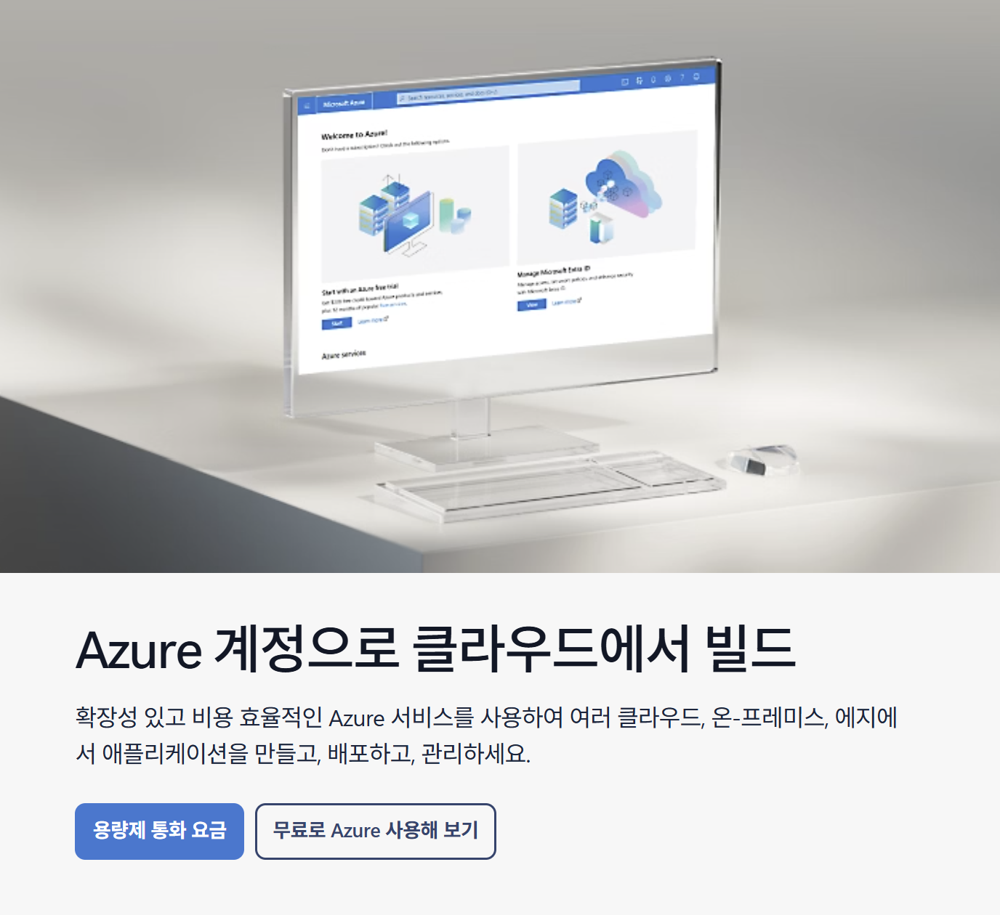
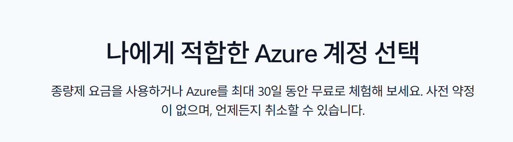
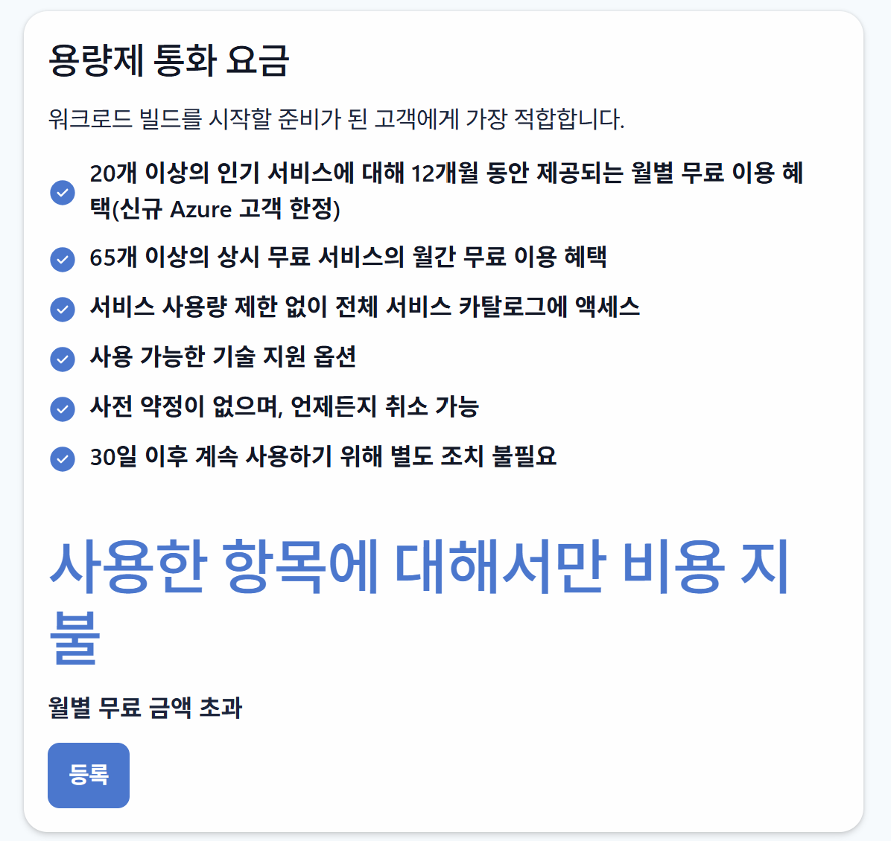
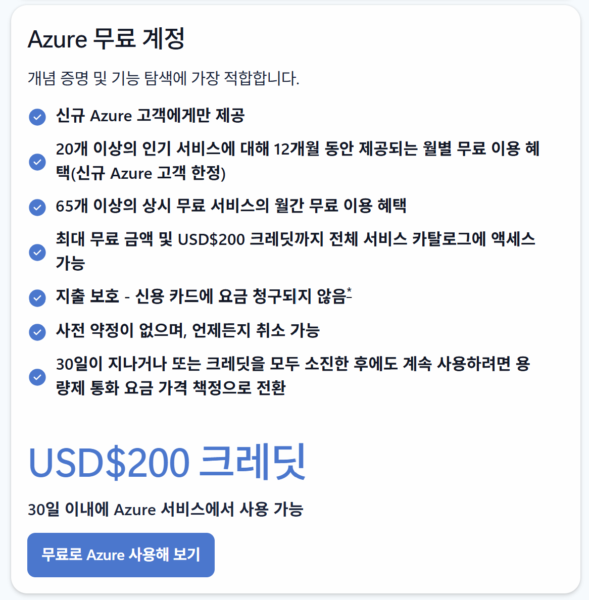
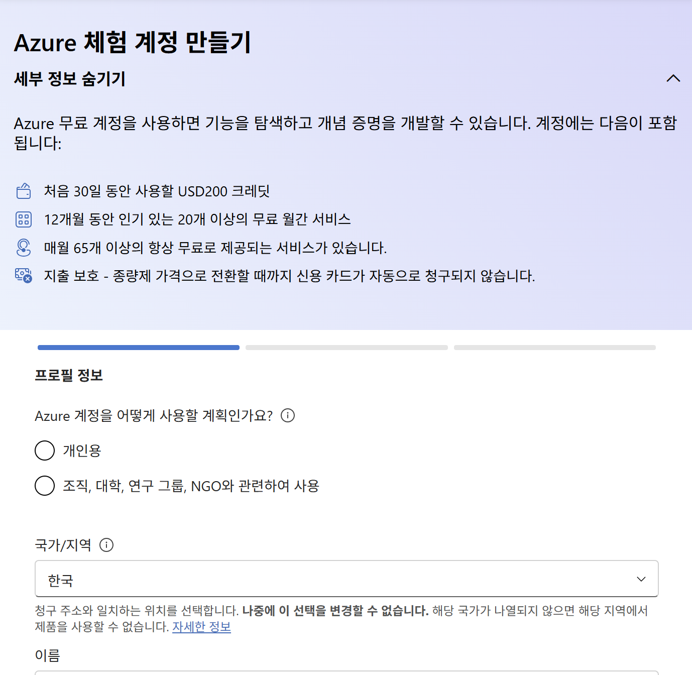
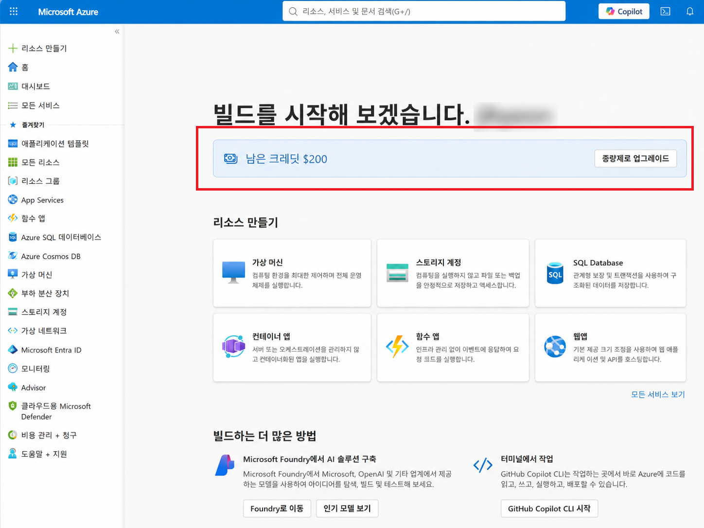

# 일반 Azure 계정 가입 안내

### 브라우저 새 프로필 만들기

- 개발 중 구독 혼동 방지를 위해 브라우저(Microsoft Edge, Chrome 등)에서 새 프로필을 만드는 것을 권장합니다.
- [새 프로필 만드는 법](./new-profile-guide.md) 안내 페이지로 이동하세요.

### 일반 Azure 계정 가입하기

1. 새 프로필을 만든 브라우저로 창을 열어 아래 방법으로 가입을 진행합니다.

2. [Azure 계정 만들기](https://azure.microsoft.com/ko-kr/pricing/purchase-options/azure-account) 웹페이지에 접속합니다.

   

3. 적합한 Azure 계정을 선택해 등록 버튼을 누릅니다.

   
   - 종량제 요금: 기존 Azure 계정이 있을 경우 선택
     - 

   - Azure 무료 계정: Azure 계정을 처음 만들 경우 선택
     - 

   - 등록 확인 프로세스 중 일시적으로 카드에 USD$1 승인이 있을 수 있으며, 이는 확인 후 취소됩니다.

4. (Azure 무료 계정 기준) 필요한 정보와 결제 카드를 입력해 계정을 등록합니다.

   

5. [Azure Portal](https://portal.azure.com)에 접속합니다.

6. Azure 무료 계정을 선택했을 경우, 아래 화면처럼 첫 화면에서 남은 크레딧이 보이는지 확인합니다.

   

   - 종량제 요금을 선택했을 경우 "구독"을 생성하여 결제 연결 후 사용할 수 있습니다.

7. 행사 전 Azure 구독 활성화를 한 번 더 확인해 주세요.

### 구독 관련 문의

구독 관련 문의는 Azure 공식 팀으로 문의하세요.
