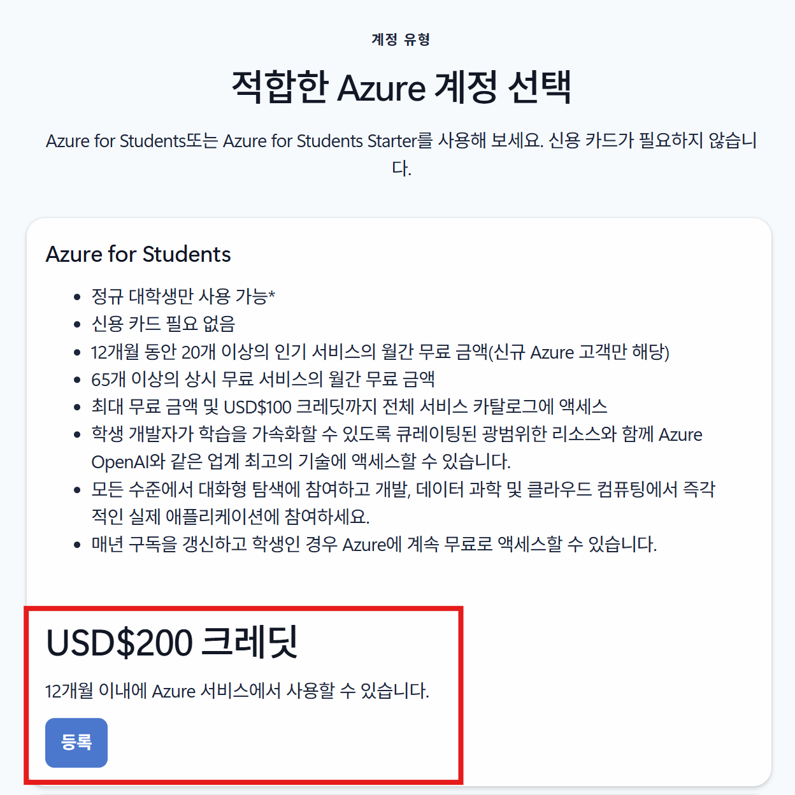
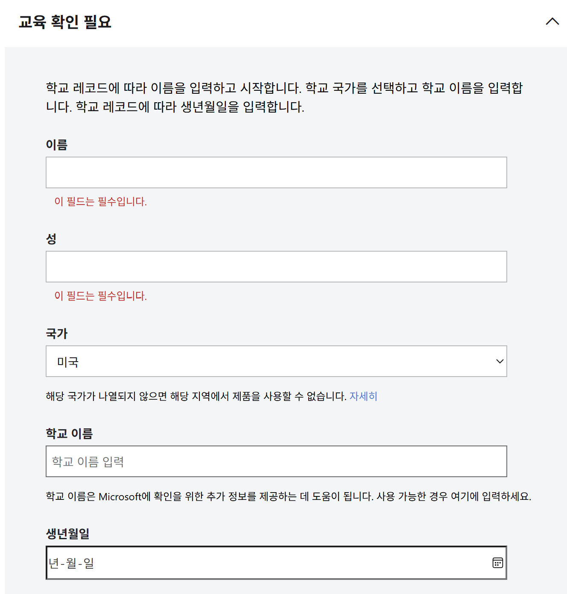
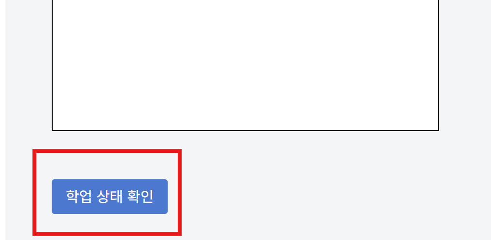
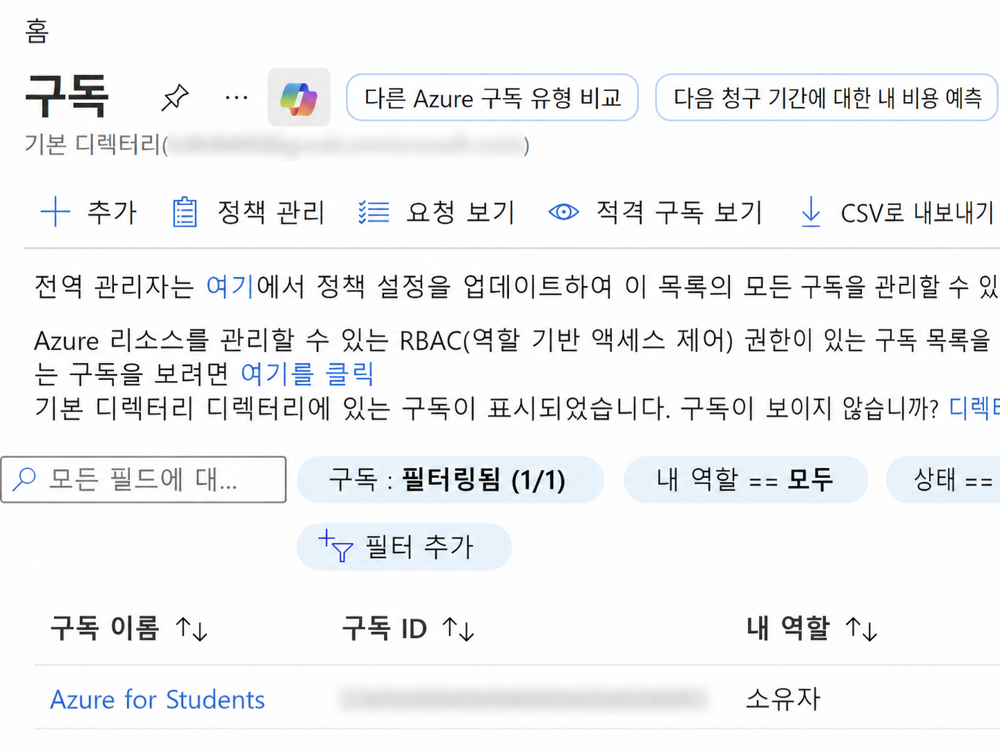

# Azure for Students 가입 안내

### 브라우저 새 프로필 만들기

- 개발 중 구독 혼동 방지를 위해 브라우저(Microsoft Edge, Chrome 등)에서 새 프로필을 만드는 것을 권장합니다.
- [새 프로필 만드는 법](./new-profile-guide.md) 안내 페이지로 이동하세요.

### Azure for Students 가입하기

1. 새 프로필을 만든 브라우저로 창을 열어 아래 방법으로 가입을 진행합니다.

2. [Azure for Students 가입 페이지](https://azure.microsoft.com/ko-kr/free/students)로 이동합니다.

3. 스크롤해 아래 페이지를 찾아 "등록"을 누릅니다.

4. 아래 필드를 모두 입력합니다.

5. 맨 아래 학업 상태 확인을 눌러 확인합니다.

6. 등록 과정을 모두 끝낸 후 Azure Portal에 접속합니다.

- [Azure Portal](https://portal.azure.com) 접속하기

7. 구독 서비스에 접속해 Azure for Students 구독이 활성화되었는지 확인합니다.

8. 행사 전 Azure for Students 라이선스 구독 활성화를 한 번 더 확인해 주세요.
