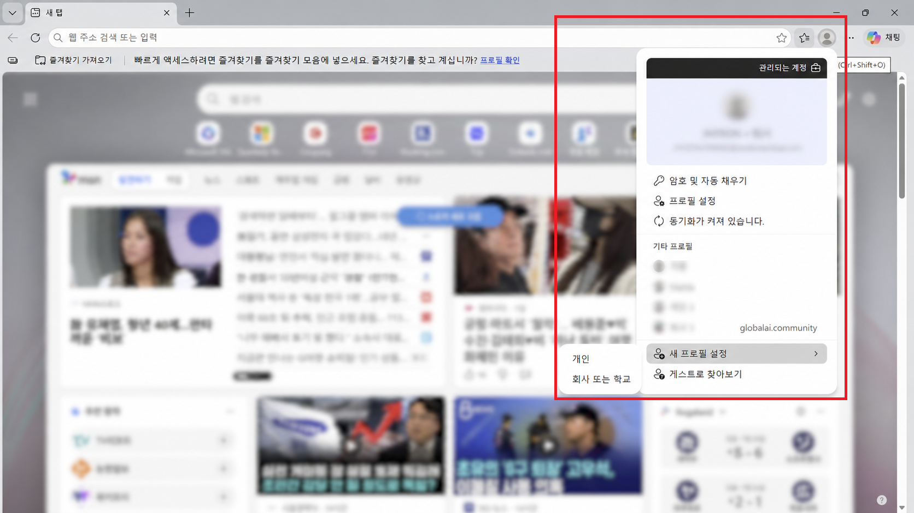
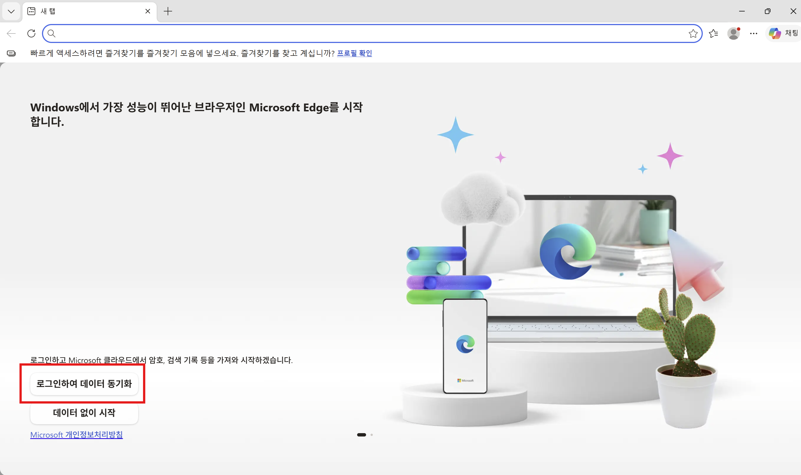

# 브라우저 새 프로필 만들기

### Microsoft Edge 기준

1. Microsoft Edge에서 오른쪽 위 프로필 버튼을 클릭하고, 새 프로필 설정 - 개인을 클릭합니다.
   - 회사 또는 학교 계정일 경우 회사 또는 학교을 클릭합니다.

2. 로그인하여 데이터 동기화를 클릭합니다.

3. Azure로 가입하려는 Microsoft 계정으로 로그인해 프로필 생성을 마칩니다.

4. 로그인 과정에서 생기는 문제는 Microsoft 공식 문의 채널을 활용하세요.

### [다시 Azure 가입을 진행하세요]

- [Azure for Students 가입 안내](./azure-for-students.md)
- [일반 Azure 계정 가입 안내, 첫 가입 시 무료 크레딧 제공](./azure-account.md)
